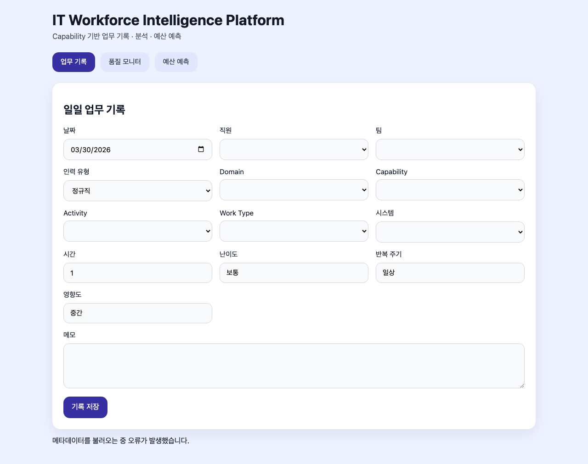

# IT Workforce Intelligence Platform

2026 운영 데이터 기반 2027 IT 예산 산정을 위한 리소스 분석 및 표준화 플랫폼

[](https://glory903-devsecops.github.io/it-workforce-intelligence-platform/)

## Overview

IT Workforce Intelligence Platform은 IT 인력의 업무 시간을 동일한 기준으로 기록하고, Capability 기반으로 정규화하여 운영 리소스와 비용 구조를 분석하는 데이터 기반 의사결정 플랫폼입니다.

이 저장소의 자세한 프로젝트 계획, 데이터 모델, 워크플로우, 특징 및 개발 전략은 `docs/project_plan.md`에서 확인할 수 있습니다.

## Demo Recording



- 녹화 파일: [frontend/video/56ca75d111e0887749f685c9977aecfa.webm](frontend/video/56ca75d111e0887749f685c9977aecfa.webm)
- 이 영상은 로컬 프론트엔드가 실행된 상태에서 주요 기능을 테스트한 화면을 보여줍니다.

## How to Use

### 사용자 역할

- **업무 기록** 탭에서 날짜, 직원, 팀, 도메인, Capability, Activity, 시스템, 시간, 난이도, 반복 주기, 영향도, 메모를 입력합니다.
- `기록 저장` 버튼을 누르면 Task Log가 서버에 저장됩니다.
- 입력한 기록은 품질 모니터링과 예산 예측에 활용됩니다.

### 관리자 역할

- **품질 모니터** 탭에서 데이터 품질 이슈를 확인하고, 문제가 발생한 기록을 점검합니다.
- **예산 예측** 탭에서 예측 항목을 입력하고 저장해, 비용 기반의 예산 계획을 수립합니다.
- 관리자는 마스터 데이터와 입력 기준을 개선하여 전체 데이터 품질을 높일 수 있습니다.

## Quick Start

### Backend

```bash
cd backend
pip install -r requirements.txt
DATABASE_URL='sqlite+aiosqlite:///./local_test.db' uvicorn app.main:app --reload --host 0.0.0.0 --port 8000
```

### Frontend

```bash
cd frontend
npm install
npm run dev -- --host 0.0.0.0 --port 5173
```

### Local URLs

- Frontend: http://localhost:5173
- Backend API: http://localhost:8000

## Frontend / Backend 연결

- 프론트엔드는 기본적으로 `http://localhost:8000`을 API 베이스 URL로 사용합니다.
- `VITE_API_BASE` 환경 변수를 설정하면 다른 백엔드 주소로 연결할 수 있습니다.

## Documentation

- [Project Plan](docs/project_plan.md) — 전체 개요, 목표, 데이터 모델, 워크플로우, 품질 전략 등

## Repository Structure

- `backend/` — FastAPI backend service
- `frontend/` — React + Vite frontend application
- `docker-compose.yml` — local development orchestrator
- `docs/` — project planning and documentation
- `frontend/video/` — demo recording files
- `README.md` — summary and quick start guide
